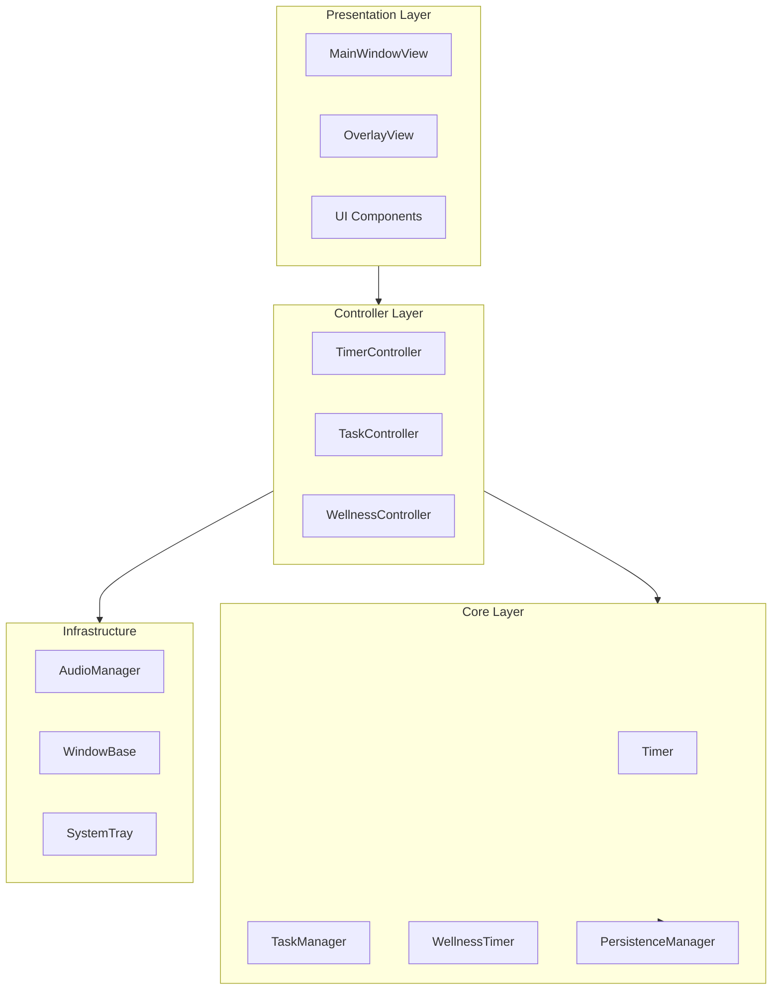
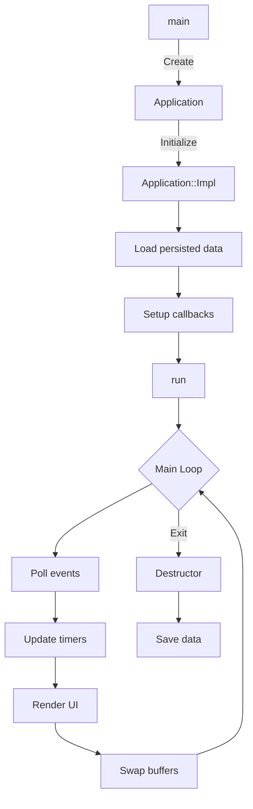
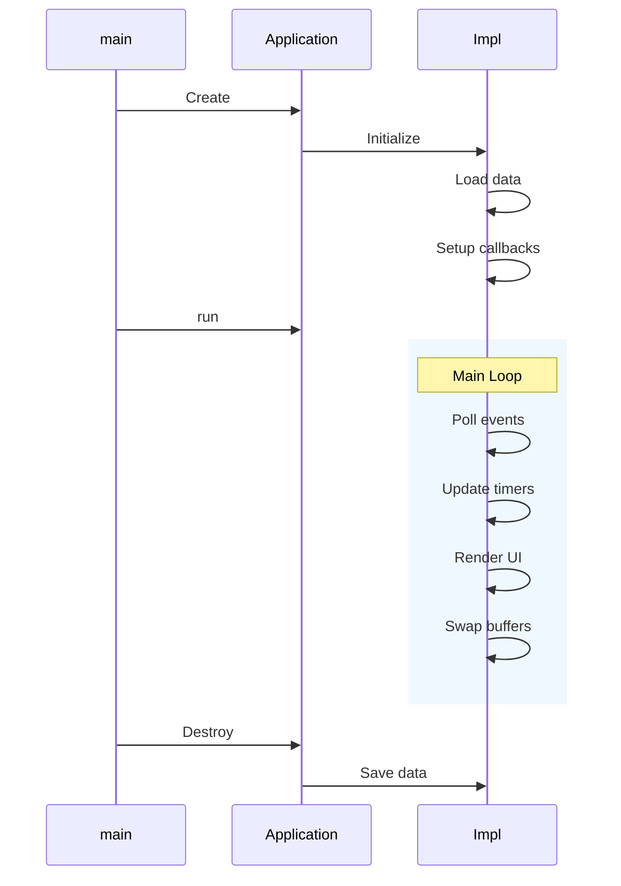
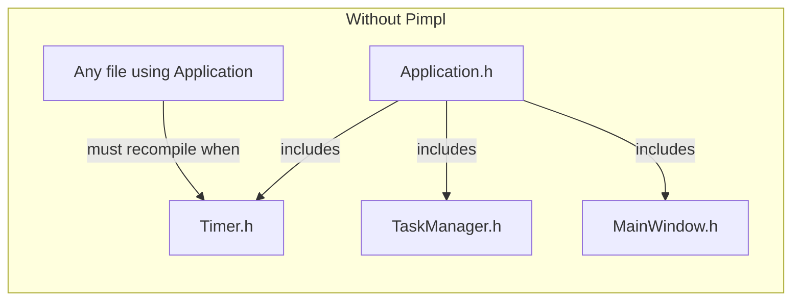
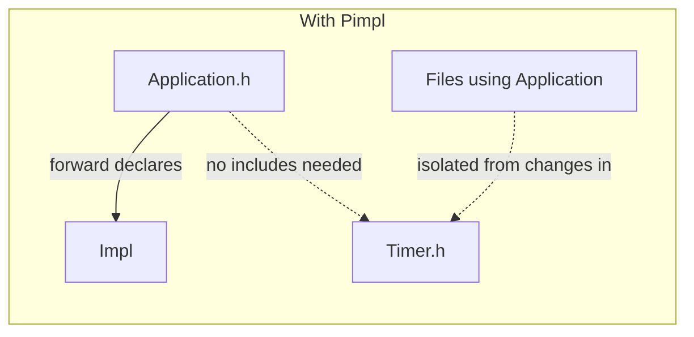
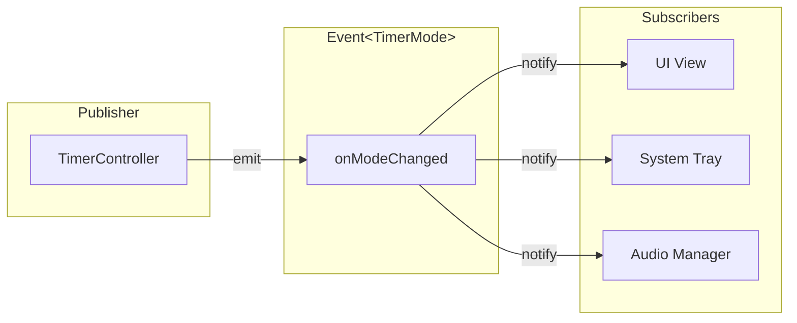
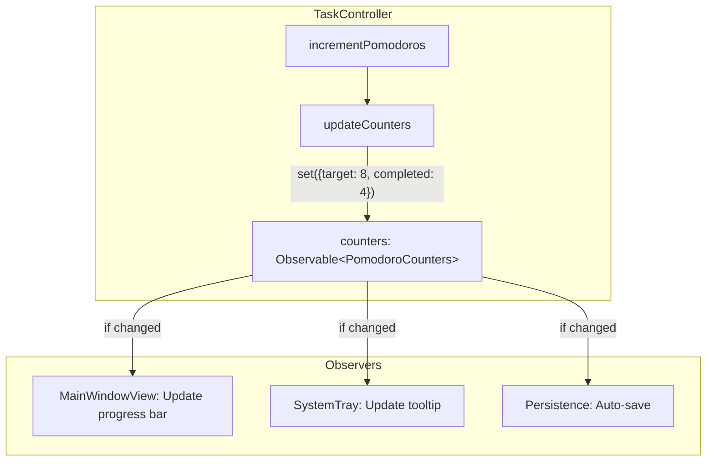
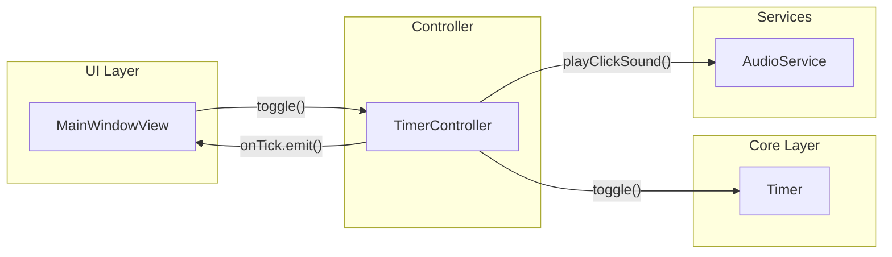
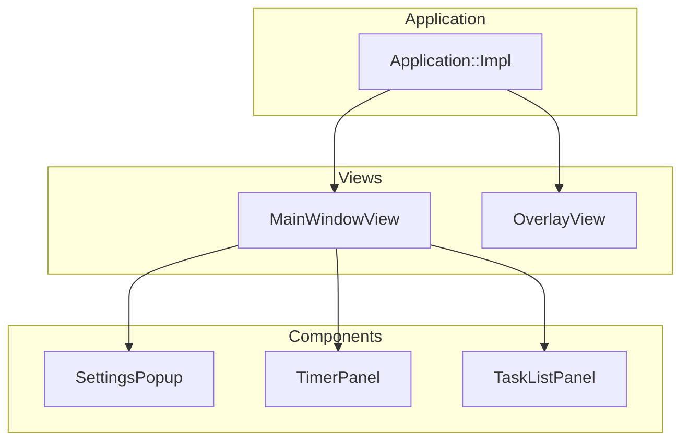
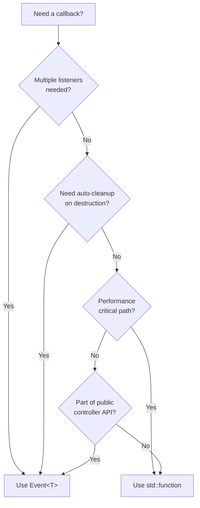

# WorkBalance Architecture Guide

Welcome to the WorkBalance codebase! This document will help you understand the architecture, design patterns, and how to extend the application.

## Table of Contents

1. [Overview](#overview)
2. [Project Structure](#project-structure)
3. [Core Architecture](#core-architecture)
4. [Event System](#event-system)
5. [Observable Pattern](#observable-pattern)
6. [Controllers](#controllers)
7. [UI Layer](#ui-layer)
8. [How to Extend](#how-to-extend)
9. [Best Practices](#best-practices)

---

## Overview

WorkBalance is a **Pomodoro timer and wellness tracking application** built with:

- **C++23** - Modern C++ with latest features
- **ImGui** - Immediate mode GUI library
- **GLFW** - Window management and OpenGL context
- **OpenGL** - Rendering backend

### High-Level Architecture



---

## Project Structure

```
WorkBalance/
├── include/                    # Header files
│   ├── app/                    # Application layer
│   │   ├── Application.h       # Main application class
│   │   ├── ApplicationEvents.h # Application-wide events & state
│   │   ├── ImGuiLayer.h        # ImGui setup and rendering
│   │   └── ui/                 # UI views and components
│   │       ├── MainWindowView.h
│   │       ├── OverlayView.h
│   │       └── components/     # Reusable UI components
│   │
│   ├── controllers/            # Business logic controllers
│   │   ├── TimerController.h
│   │   ├── TaskController.h
│   │   └── WellnessController.h
│   │
│   ├── core/                   # Domain models and utilities
│   │   ├── Timer.h             # Pomodoro timer
│   │   ├── Task.h              # Task management
│   │   ├── WellnessTimer.h     # Wellness reminders
│   │   ├── Event.h             # Event system (pub/sub)
│   │   ├── Observable.h        # Observable state pattern
│   │   ├── Configuration.h     # Constants and defaults
│   │   └── Persistence.h       # Save/load functionality
│   │
│   ├── system/                 # System integration
│   │   ├── AudioManager.h      # Sound playback
│   │   ├── MainWindow.h        # Main window management
│   │   ├── OverlayWindow.h     # Floating overlay
│   │   └── SystemTray.h        # System tray icon
│   │
│   └── ui/                     # UI utilities
│       └── AppState.h          # UI state management
│
├── src/                        # Implementation files
│   └── (mirrors include structure)
│
├── tests/                      # Unit tests (GoogleTest)
│
└── assets/                     # Fonts, icons, sounds
```

---

## Core Architecture

### Application Lifecycle

**Flowchart View:**



**Sequence Diagram View:**



### Dependency Injection

We use **interface-based dependency injection** for testability:

```cpp
// Interface for time source (allows mocking in tests)
class ITimeSource {
public:
    virtual ~ITimeSource() = default;
    virtual std::chrono::steady_clock::time_point now() const = 0;
};

// Production implementation
class SystemTimeSource : public ITimeSource { /* uses system clock */ };

// Test implementation
class MockTimeSource : public ITimeSource { /* controllable time */ };

// Timer accepts any ITimeSource
Timer::Timer(int duration, std::shared_ptr<ITimeSource> time_source);
```

### Pimpl Idiom (Pointer to Implementation)

The `Application` class uses the **Pimpl idiom** to hide implementation details:

```cpp
// Application.h (public header - minimal includes)
class Application {
public:
    Application();
    ~Application();
    void run();
    
private:
    class Impl;                    // Forward declaration only
    std::unique_ptr<Impl> m_impl;  // Pointer to implementation
};

// Application.cpp (private implementation)
class Application::Impl {
    // All actual members are hidden here
    Core::Timer m_timer;
    Core::TaskManager m_task_manager;
    System::MainWindow m_main_window;
    Controllers::TimerController m_timer_controller;
    // ... many more members
    
public:
    void run() { /* actual implementation */ }
};
```

**Why Use Pimpl?**





| Benefit | Description |
|---------|-------------|
| **Faster compilation** | Changes to `Impl` don't require recompiling files that include `Application.h` |
| **ABI stability** | Binary compatibility maintained when implementation changes |
| **Encapsulation** | Users of `Application` don't see internal dependencies |
| **Reduced includes** | Header file stays minimal, reducing include chain |

**When You'll Encounter It:**

- `Application` → `Application::Impl` - Main application class
- In diagrams, `Impl` refers to the private implementation class

---

## Event System

The Event system enables **decoupled communication** between components using the publish/subscribe pattern.

### How It Works



### Event Class (`include/core/Event.h`)

```cpp
template <typename... Args>
class Event {
public:
    using Handler = std::function<void(Args...)>;
    using HandlerId = std::size_t;

    // Subscribe to the event
    [[nodiscard]] HandlerId subscribe(Handler handler);
    
    // Unsubscribe using the returned ID
    void unsubscribe(HandlerId id);
    
    // Emit the event to all subscribers
    void emit(Args... args) const;
    
    // Check if anyone is listening
    [[nodiscard]] bool hasSubscribers() const noexcept;
    
    // Remove all subscribers
    void clear() noexcept;
};

// Convenience aliases
using VoidEvent = Event<>;
using IntEvent = Event<int>;
using BoolEvent = Event<bool>;
```

### Usage Examples

#### Basic Event Usage

```cpp
#include <core/Event.h>

// Declare an event
Core::Event<int> onValueChanged;

// Subscribe (returns an ID for later unsubscription)
auto id = onValueChanged.subscribe([](int value) {
    std::cout << "Value changed to: " << value << '\n';
});

// Emit the event (all subscribers are notified)
onValueChanged.emit(42);  // Prints: "Value changed to: 42"

// Unsubscribe when done
onValueChanged.unsubscribe(id);
```

#### Using EventGuard for RAII

```cpp
#include <core/Event.h>

void someFunction(Core::Event<>& event) {
    // EventGuard automatically unsubscribes when it goes out of scope
    Core::EventGuard<> guard(event, []() {
        std::cout << "Event fired!\n";
    });
    
    event.emit();  // Prints: "Event fired!"
    
}  // guard destructor calls unsubscribe automatically
```

#### Multiple Arguments

```cpp
Core::Event<std::string, int, bool> onComplexEvent;

onComplexEvent.subscribe([](const std::string& name, int count, bool success) {
    std::cout << name << ": " << count << " (" << (success ? "OK" : "FAIL") << ")\n";
});

onComplexEvent.emit("Task", 5, true);  // Prints: "Task: 5 (OK)"
```

### Events in Controllers

Controllers expose events that other components can subscribe to:

```cpp
// TimerController.h
class TimerController {
public:
    // Events that fire on state changes
    Core::Event<Core::TimerMode> onModeChanged;
    Core::Event<int> onTick;       // remaining seconds
    Core::Event<> onComplete;
};

// Usage in Application
timerController.onComplete.subscribe([this]() {
    playBellSound();
    showNotification("Timer complete!");
});

timerController.onTick.subscribe([this](int remaining) {
    updateWindowTitle(remaining);
});
```

---

## Observable Pattern

The Observable pattern wraps a value and **automatically notifies observers when it changes**. We use this pattern extensively for counters and state that the UI needs to track.

### Real-World Example: Task Progress Tracking

In WorkBalance, we track pomodoro progress using `Observable<PomodoroCounters>`:



### Without Observable: Manual Synchronization

Without Observable, you must manually keep UI in sync:

```cpp
// TaskController.h (WITHOUT Observable)
class TaskController {
public:
    void incrementPomodoros(size_t index);
    
    // Must provide a getter - consumers poll this
    [[nodiscard]] int getCompletedPomodoros() const;
    [[nodiscard]] int getTargetPomodoros() const;
    
    // Need a callback to notify changes
    std::function<void()> onCountersChanged;

private:
    Core::TaskManager& m_manager;
};

// Application.cpp (WITHOUT Observable)
void Application::Impl::setupTaskController() {
    // Must remember to set up callback
    m_task_controller.onCountersChanged = [this]() {
        // Must manually update each consumer
        m_state.completed_pomodoros = m_task_controller.getCompletedPomodoros();
        m_state.target_pomodoros = m_task_controller.getTargetPomodoros();
        
        // Easy to forget: update system tray too!
        m_system_tray.updateTooltip(m_state.completed_pomodoros, m_state.target_pomodoros);
        
        // Easy to forget: trigger auto-save
        m_persistence.markDirty();
    };
}

// TaskController.cpp (WITHOUT Observable)
void TaskController::incrementPomodoros(size_t index) {
    m_manager.incrementTaskPomodoros(index);
    
    // Must remember to call callback
    if (onCountersChanged) {
        onCountersChanged();
    }
    // What if we forget? UI becomes stale!
}
```

**Problems with manual approach:**
- ❌ Easy to forget calling the callback
- ❌ Single callback - can't have multiple listeners
- ❌ Consumers must poll getters
- ❌ No change detection - callback fires even if values didn't change

### With Observable: Automatic Synchronization

```cpp
// TaskController.h (WITH Observable)
class TaskController {
public:
    void incrementPomodoros(size_t index);
    
    /// @brief Observable counters - observe for automatic updates
    Core::Observable<PomodoroCounters> counters{};

private:
    Core::TaskManager& m_manager;
    void updateCounters();  // Internal helper
};

// Application.cpp (WITH Observable)
void Application::Impl::setupTaskController() {
    // Each observer is independent - can add as many as needed
    m_task_controller.counters.observe([this](const auto& old_c, const auto& new_c) {
        m_state.completed_pomodoros = new_c.completed_pomodoros;
        m_state.target_pomodoros = new_c.target_pomodoros;
    });
    
    m_task_controller.counters.observe([this](const auto&, const auto& new_c) {
        m_system_tray.updateTooltip(new_c.completed_pomodoros, new_c.target_pomodoros);
    });
    
    m_task_controller.counters.observe([this](const auto&, const auto&) {
        m_persistence.markDirty();
    });
}

// TaskController.cpp (WITH Observable)
void TaskController::incrementPomodoros(size_t index) {
    m_manager.incrementTaskPomodoros(index);
    updateCounters();  // Always call - Observable handles the rest
}

void TaskController::updateCounters() {
    // Observable only notifies if value actually changed
    counters.set(PomodoroCounters{
        .target_pomodoros = m_manager.getTargetPomodoros(),
        .completed_pomodoros = m_manager.getCompletedPomodoros()
    });
}
```

**Benefits with Observable:**
- ✅ Automatic change detection (only notifies when value differs)
- ✅ Multiple independent observers
- ✅ Observers receive both old and new values
- ✅ Can't forget to notify - always call `updateCounters()`

### Our Actual Code

**PomodoroCounters struct** ([TaskController.h](include/controllers/TaskController.h)):

```cpp
struct PomodoroCounters {
    int target_pomodoros = 0;
    int completed_pomodoros = 0;

    // Required for Observable change detection
    bool operator==(const PomodoroCounters&) const = default;
    bool operator!=(const PomodoroCounters&) const = default;
};
```

**WellnessCounters struct** ([WellnessController.h](include/controllers/WellnessController.h)):

```cpp
struct WellnessCounters {
    int water_glasses = 0;
    int standups_completed = 0;
    int eye_breaks_completed = 0;

    bool operator==(const WellnessCounters&) const = default;
    bool operator!=(const WellnessCounters&) const = default;
};
```

### Observable Class API (`include/core/Observable.h`)

```cpp
template <typename T>
class Observable {
public:
    using Observer = std::function<void(const T& old_value, const T& new_value)>;

    explicit Observable(T initial = {});
    
    // Get current value
    [[nodiscard]] const T& get() const noexcept;
    
    // Implicit conversion for convenience
    [[nodiscard]] operator const T&() const noexcept;
    
    // Set value (notifies only if changed)
    void set(T new_value);
    
    // Set value (always notifies, even if unchanged)
    void forceSet(T new_value);
    
    // Add an observer - called when value changes
    void observe(Observer observer);
    
    // Modify value in-place with a function
    template <typename F>
    bool modify(F&& modifier);
};
```

### Usage Patterns

#### Pattern 1: UI State Binding

```cpp
// In Application setup
m_task_controller.counters.observe([this](const auto&, const auto& new_c) {
    // AppState is updated automatically when counters change
    m_state.completed_pomodoros = new_c.completed_pomodoros;
    m_state.target_pomodoros = new_c.target_pomodoros;
});
```

#### Pattern 2: Cross-Component Communication

```cpp
// WellnessController notifies when water count changes
m_wellness_controller.counters.observe([this](const auto& old_c, const auto& new_c) {
    if (new_c.water_glasses > old_c.water_glasses) {
        // Show celebration when user drinks water
        showEncouragement("Great job staying hydrated!");
    }
});
```

#### Pattern 3: Persistence Triggers

```cpp
// Auto-save when any counter changes
m_task_controller.counters.observe([this](const auto&, const auto&) {
    scheduleAutosave();
});

m_wellness_controller.counters.observe([this](const auto&, const auto&) {
    scheduleAutosave();
});
```

### Comparison Table: Observable vs Manual

| Aspect | Manual (std::function) | Observable |
|--------|------------------------|------------|
| **Multiple observers** | ❌ Only one | ✅ Unlimited |
| **Change detection** | ❌ Manual | ✅ Automatic |
| **Old value access** | ❌ Must store separately | ✅ Provided to observer |
| **Forget to notify** | ❌ Common bug | ✅ Consistent pattern |
| **Memory overhead** | Lower | Higher (observer list) |
| **Polling vs Push** | Polling with getters | Push to observers |

---

## Controllers

Controllers contain **business logic** and sit between the UI and core domain models.

### Controller Responsibilities



### TimerController Example

```cpp
class TimerController {
public:
    explicit TimerController(Core::Timer& timer, System::IAudioService* audio);

    void toggle();                          // Start/pause
    void reset();                           // Reset to initial time
    void setMode(Core::TimerMode mode);     // Change mode
    [[nodiscard]] bool update();            // Call each frame
    
    // Events
    Core::Event<Core::TimerMode> onModeChanged;
    Core::Event<int> onTick;
    Core::Event<> onComplete;

private:
    Core::Timer& m_timer;
    System::IAudioService* m_audio;
};
```

### TaskController Example

```cpp
class TaskController {
public:
    explicit TaskController(Core::TaskManager& manager);

    void add(std::string_view name, int estimated_pomodoros);
    void remove(size_t index);
    void update(size_t index, std::string_view name, int estimated, int completed);
    void toggleCompletion(size_t index);
    void incrementPomodoros(size_t index);
    
    // Observable state
    Core::Observable<PomodoroCounters> counters{};
    
    // Event
    Core::Event<> onTasksChanged;

private:
    Core::TaskManager& m_manager;
};
```

---

## UI Layer

### View Architecture



### Callback Pattern for UI

Views receive callbacks for user actions:

```cpp
// MainWindowCallbacks.h
struct MainWindowCallbacks {
    std::function<void()> onToggleTimer;
    std::function<void(Core::TimerMode)> onModeChange;
    std::function<void()> onToggleOverlayMode;
    std::function<void()> onRequestClose;
    std::function<void(int, int, int)> onDurationsApplied;
    std::function<void(std::string_view, int)> onTaskAdded;
    std::function<void(size_t)> onTaskRemoved;
    // ... more callbacks
};

// MainWindowView constructor
MainWindowView(Window& window, Timer& timer, AppState& state, 
               MainWindowCallbacks callbacks);
```

---

## How to Extend

### Adding a New Feature: Focus Mode

Let's walk through adding a "Focus Mode" feature that blocks notifications.

#### Step 1: Add to Configuration

```cpp
// include/core/Configuration.h
namespace Configuration {
    // Add new constants
    constexpr bool DEFAULT_FOCUS_MODE = false;
    constexpr int FOCUS_MODE_DURATION_MINUTES = 25;
}
```

#### Step 2: Create/Update Controller

```cpp
// Option A: Add to existing TimerController
class TimerController {
public:
    // New methods
    void enableFocusMode();
    void disableFocusMode();
    [[nodiscard]] bool isFocusModeActive() const;
    
    // New events
    Core::Event<bool> onFocusModeChanged;
    
private:
    bool m_focus_mode = false;
};

// Option B: Create new FocusController
class FocusController {
public:
    void toggle();
    void setDuration(int minutes);
    
    Core::Observable<bool> isActive{false};
    Core::Event<> onFocusSessionComplete;
};
```

#### Step 3: Add UI Component

```cpp
// include/app/ui/components/FocusModeButton.h
class FocusModeButton {
public:
    FocusModeButton(Core::Observable<bool>& focusState);
    void render();
    
private:
    Core::Observable<bool>& m_focus_state;
};
```

#### Step 4: Wire Up in Application

```cpp
// Application.cpp
void Application::Impl::setupFocusMode() {
    m_focus_controller.isActive.observe([this](bool, bool active) {
        if (active) {
            m_system_tray.setDoNotDisturb(true);
        } else {
            m_system_tray.setDoNotDisturb(false);
        }
    });
}
```

#### Step 5: Add Tests

```cpp
// tests/FocusControllerTest.cpp
TEST(FocusControllerTest, ToggleChangesState) {
    FocusController controller;
    
    bool notified = false;
    controller.isActive.observe([&](bool, bool) {
        notified = true;
    });
    
    controller.toggle();
    
    EXPECT_TRUE(controller.isActive.get());
    EXPECT_TRUE(notified);
}
```

### Adding a New Wellness Timer Type

```cpp
// 1. Add to WellnessTypes.h
enum class WellnessType {
    Water,
    Standup,
    EyeStrain,
    Stretch      // NEW
};

// 2. Add configuration defaults
namespace WellnessDefaults {
    constexpr int DEFAULT_STRETCH_INTERVAL = 45 * 60;  // 45 minutes
    constexpr int DEFAULT_STRETCH_DURATION = 60;       // 1 minute
}

// 3. Add timer to WellnessController
class WellnessController {
    std::unique_ptr<Core::WellnessTimer> m_stretch_timer;
    
public:
    void toggleStretch();
    void acknowledgeStretch();
    // ...
};

// 4. Add UI in WellnessViews.cpp
void renderStretchPanel(WellnessTimer* timer, /* callbacks */);
```

---

## Best Practices

### 1. Use Events for Actions, Observables for State

```cpp
// ✅ Good: Event for action notification
Core::Event<> onTimerComplete;  // "Something happened"

// ✅ Good: Observable for state
Core::Observable<bool> isRunning{false};  // "Current state is X"

// ❌ Avoid: Event for state queries
Core::Event<bool> onRunningStateQueried;  // Don't do this
```

### 2. Prefer const References in Observers

```cpp
// ✅ Good: const references avoid copies
counters.observe([](const PomodoroCounters& old_val, 
                    const PomodoroCounters& new_val) {
    // ...
});

// ❌ Avoid: Copying large objects
counters.observe([](PomodoroCounters old_val, 
                    PomodoroCounters new_val) {
    // Unnecessary copies
});
```

### 3. Use EventGuard for Scoped Subscriptions

```cpp
// ✅ Good: Automatic cleanup
class MyComponent {
    Core::EventGuard<int> m_tick_guard;
    
public:
    MyComponent(TimerController& timer)
        : m_tick_guard(timer.onTick, [this](int t) { onTick(t); })
    {}
    // Automatically unsubscribes when MyComponent is destroyed
};
```

### 4. Keep Controllers Focused

```cpp
// ✅ Good: Single responsibility
class TimerController { /* only timer logic */ };
class TaskController { /* only task logic */ };
class WellnessController { /* only wellness logic */ };

// ❌ Avoid: God controller
class MegaController {
    // Timer, tasks, wellness, audio, persistence, UI state...
};
```

### 5. Use Dependency Injection

```cpp
// ✅ Good: Injectable dependencies
class TimerController {
public:
    TimerController(Timer& timer, IAudioService* audio);
};

// ❌ Avoid: Hard-coded dependencies
class TimerController {
    AudioManager m_audio;  // Can't mock in tests
};
```

### 6. Add operator== for Observable Types

```cpp
// ✅ Required for Observable change detection
struct MyState {
    int value;
    std::string name;
    
    bool operator==(const MyState&) const = default;
    bool operator!=(const MyState&) const = default;
};

Core::Observable<MyState> state{};  // Works correctly
```

---

## Event System vs std::function Callbacks

During refactoring, we migrated from `std::function` callbacks to the Event system. Here's a detailed comparison to help you understand the trade-offs.

### Side-by-Side Comparison

#### Before: std::function Callbacks

```cpp
// TimerController.h (OLD)
class TimerController {
public:
    // Single callback per event
    std::function<void(TimerMode)> onModeChanged;
    std::function<void(int)> onTick;
    std::function<void()> onComplete;
    
    void toggle() {
        // ...
        if (onComplete) {
            onComplete();  // Must check for null
        }
    }
};

// Application.cpp (OLD)
void Application::Impl::setupTimerCallbacks() {
    // Can only have ONE subscriber
    m_timer_controller.onComplete = [this]() {
        playBellSound();
    };
    
    // This REPLACES the previous callback!
    m_timer_controller.onComplete = [this]() {
        showNotification();  // playBellSound() is now lost!
    };
}
```

#### After: Event System

```cpp
// TimerController.h (NEW)
class TimerController {
public:
    // Multiple subscribers supported
    Core::Event<TimerMode> onModeChanged;
    Core::Event<int> onTick;
    Core::Event<> onComplete;
    
    void toggle() {
        // ...
        onComplete.emit();  // No null check needed
    }
};

// Application.cpp (NEW)
void Application::Impl::setupTimerCallbacks() {
    // Multiple subscribers - both are called!
    m_timer_controller.onComplete.subscribe([this]() {
        playBellSound();
    });
    
    m_timer_controller.onComplete.subscribe([this]() {
        showNotification();  // playBellSound() still works!
    });
}
```

### Comparison Table

| Aspect | std::function | Event System |
|--------|---------------|--------------|
| **Multiple Subscribers** | ❌ Only one | ✅ Unlimited |
| **Null Check Required** | ✅ Yes, must check `if (callback)` | ❌ No, `emit()` handles empty |
| **Memory Overhead** | Lower (single function) | Higher (vector + IDs) |
| **Unsubscription** | Manual (set to nullptr) | Built-in with IDs |
| **RAII Support** | ❌ Manual cleanup | ✅ EventGuard |
| **Compile Time** | Faster | Slightly slower (templates) |
| **Debugging** | Simpler stack traces | More indirection |
| **Thread Safety** | Not inherent | Can be added centrally |

### Detailed Pros and Cons

#### ✅ Advantages of Event System

**1. Multiple Subscribers (Fan-out)**

```cpp
// Multiple components can react to the same event
timerController.onComplete.subscribe([&]() { playSound(); });
timerController.onComplete.subscribe([&]() { updateUI(); });
timerController.onComplete.subscribe([&]() { logAnalytics(); });
timerController.onComplete.subscribe([&]() { saveProgress(); });

// All four handlers are called when timer completes
```

**2. No Null Checks Required**

```cpp
// OLD: Must check before calling
if (onComplete) {
    onComplete();
}

// NEW: Safe to call even with no subscribers
onComplete.emit();  // Does nothing if no subscribers
```

**3. RAII-based Lifetime Management**

```cpp
class TemporaryListener {
    Core::EventGuard<int> m_guard;
    
public:
    TemporaryListener(TimerController& timer)
        : m_guard(timer.onTick, [](int t) { /* handle tick */ })
    {}
    
    // Automatically unsubscribes when destroyed - no memory leaks!
};
```

**4. Decoupled Architecture**

```cpp
// Publishers don't know about subscribers
class TimerController {
    void complete() {
        onComplete.emit();  // Don't care who's listening
    }
};

// Subscribers don't need direct access to publisher internals
class SystemTray {
    void connectTo(TimerController& timer) {
        timer.onComplete.subscribe([this]() {
            showBalloonTip("Timer done!");
        });
    }
};
```

**5. Dynamic Subscription/Unsubscription**

```cpp
// Subscribe conditionally
auto id = event.subscribe(handler);

// Unsubscribe when feature is disabled
if (featureDisabled) {
    event.unsubscribe(id);
}

// Re-subscribe when feature is re-enabled
if (featureEnabled) {
    id = event.subscribe(handler);
}
```

#### ❌ Disadvantages of Event System

**1. Higher Memory Overhead**

```cpp
// std::function: ~32-48 bytes per callback
std::function<void()> callback;

// Event: vector + map for IDs + mutex (if thread-safe)
// Approximately 80-120+ bytes base + per-subscriber overhead
Event<> event;
```

**2. Slightly More Complex Debugging**

```cpp
// std::function: Direct call, simple stack trace
callback();  // Stack: callback -> handler

// Event: Indirect calls through emit()
event.emit();  // Stack: emit -> loop -> handler1, handler2, ...
```

**3. Subscription ID Management**

```cpp
// Must store ID if you need to unsubscribe later
auto id = event.subscribe(handler);
// ... somewhere else ...
event.unsubscribe(id);  // Need to track 'id'

// vs std::function where you just set to nullptr
callback = nullptr;
```

**4. Order of Execution Not Guaranteed**

```cpp
// Subscribers are called in subscription order, but this
// shouldn't be relied upon for business logic
event.subscribe([]() { step1(); });  // Called first
event.subscribe([]() { step2(); });  // Called second
// Don't depend on this order!
```

### When to Use Each



#### Use Event When:
- Multiple components need to react to the same occurrence
- You want automatic cleanup with EventGuard
- Building public APIs that others will subscribe to
- You need dynamic subscribe/unsubscribe capabilities

#### Use std::function When:
- Only one handler is ever needed (1:1 relationship)
- Performance is critical (hot path, millions of calls/sec)
- Simple internal callbacks within a single class
- Temporary/local callbacks that don't escape scope

### Migration Pattern

If you need to migrate from `std::function` to Event:

```cpp
// Step 1: Change the declaration
// OLD
std::function<void(int)> onValueChanged;

// NEW
Core::Event<int> onValueChanged;

// Step 2: Change the emission
// OLD
if (onValueChanged) {
    onValueChanged(value);
}

// NEW
onValueChanged.emit(value);

// Step 3: Change subscriptions
// OLD
controller.onValueChanged = [](int v) { handle(v); };

// NEW
controller.onValueChanged.subscribe([](int v) { handle(v); });
```

---

## Quick Reference

### Common Patterns

| Pattern | When to Use | Example |
|---------|-------------|---------|
| `Event<T>` | Notify about actions/occurrences | Timer completed, button clicked |
| `Observable<T>` | Track state changes | Counter value, running state |
| `EventGuard<T>` | Auto-unsubscribe on scope exit | Component lifetime subscriptions |
| Controller | Business logic layer | TimerController, TaskController |

### File Naming Conventions

| Type | Location | Example |
|------|----------|---------|
| Interface | `include/system/` | `IAudioService.h` |
| Controller | `include/controllers/` | `TimerController.h` |
| Core Model | `include/core/` | `Timer.h`, `Task.h` |
| UI View | `include/app/ui/` | `MainWindowView.h` |
| UI Component | `include/app/ui/components/` | `TimerPanel.h` |

### Testing

```bash
# Build tests
cmake --build --preset x64-debug

# Run all tests
./out/build/x64-debug/Debug/WorkBalanceTests.exe

# Run specific test
./out/build/x64-debug/Debug/WorkBalanceTests.exe --gtest_filter="EventTest.*"
```

---

## Further Reading

- [TODO_REFACTORING.md](TODO_REFACTORING.md) - Detailed refactoring plan and design decisions
- [BUILD.md](BUILD.md) - Build instructions
- [README.md](README.md) - Project overview

---

*Last updated: January 2026*
