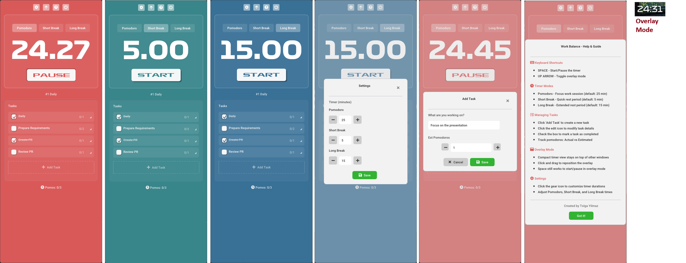

# WorkBalance

<div align="center">



**A modern, cross-platform Pomodoro timer inspired by [Pomofocus.io](https://pomofocus.io)**

[](LICENSE)
[](CROSS_PLATFORM.md)
[](https://en.cppreference.com/w/cpp/20)
[](https://cmake.org/)
[](../../releases)

</div>

---

## 🎯 About

WorkBalance is a desktop Pomodoro timer application designed to help you stay productive and focused. Inspired by the web-based [Pomofocus.io](https://pomofocus.io), it brings the simplicity and elegance of the Pomodoro Technique to a native desktop experience.

---

## ✨ Features

- 🍅 **Pomodoro Timer** - Classic 25/5/15 minute work/break intervals
- 📝 **Task Management** - Track tasks and completed pomodoros
- 🎨 **Modern UI** - Clean, distraction-free interface with Formula1 fonts
- 🔊 **Audio Alerts** - Embedded sound notifications for timer events
- 🪟 **Overlay Mode** - Compact, always-on-top timer view
- 🌐 **Cross-Platform** - Runs on Windows, Linux, and macOS
- 📦 **Self-Contained** - All assets embedded in the executable

---

## 🖼️ Screenshots

### Main Interface


### Overlay Mode
A compact, transparent timer that stays on top of other windows for distraction-free focus.

---

## 🛠️ Technologies

WorkBalance is built with modern C++20 and the following cross-platform libraries:

| Library | Purpose | License |
|---------|---------|---------|
| [Dear ImGui](https://github.com/ocornut/imgui) | Immediate mode GUI framework | MIT |
| [GLFW](https://www.glfw.org/) | Cross-platform windowing and input | Zlib |
| [miniaudio](https://github.com/mackron/miniaudio) | Lightweight audio playback | MIT-0 |
| [stb_image](https://github.com/nothings/stb) | Image loading | MIT/Public Domain |
| [OpenGL](https://www.opengl.org/) | Graphics rendering | - |

All dependencies are managed via [vcpkg](https://vcpkg.io/) for seamless cross-platform builds.

---

## 📦 Building from Source

WorkBalance uses **CMake** for a modern, cross-platform build experience. The build system automatically handles all dependencies and asset embedding.

### Prerequisites

- **C++20 compatible compiler**
  - Windows: Visual Studio 2019+ / MSVC 19.25+
  - Linux: GCC 9+ or Clang 10+
  - macOS: Xcode 12+ / Apple Clang 12+
- **CMake 3.15 or higher**
- **vcpkg** (for dependency management)
- **Git**

### Quick Start

#### 1. Clone the Repository
```bash
git clone https://github.com/yourusername/WorkBalance.git
cd WorkBalance
```

#### 2. Install vcpkg (if not already installed)

**Windows (PowerShell):**
```powershell
git clone https://github.com/Microsoft/vcpkg.git
cd vcpkg
.\bootstrap-vcpkg.bat
```

**Linux/macOS:**
```bash
git clone https://github.com/Microsoft/vcpkg.git
cd vcpkg
./bootstrap-vcpkg.sh
```

#### 3. Build with CMake

**Windows:**
```powershell
# Configure
cmake --preset x64-release

# Build
cmake --build --preset x64-release

# Run
.\out\build\x64-release\Release\WorkBalance.exe
```

**Linux/macOS:**
```bash
# Configure
mkdir build && cd build
cmake .. -DCMAKE_BUILD_TYPE=Release \
    -DCMAKE_TOOLCHAIN_FILE=~/vcpkg/scripts/buildsystems/vcpkg.cmake

# Build
cmake --build . --config Release

# Run
./WorkBalance
```

### Build Presets

The project includes CMake presets for common configurations:

- `x64-debug` - Debug build with symbols
- `x64-release` - Optimized release build

```bash
cmake --preset x64-release
cmake --build --preset x64-release
```

---

## 🌐 Cross-Platform Support

WorkBalance is designed to work seamlessly across all major desktop platforms:

| Platform | Status | Notes |
|----------|--------|-------|
| **Windows 10/11** | ✅ Fully Supported | Includes rounded window corners on Windows 11 |
| **Linux** | ✅ Fully Supported | Tested on Ubuntu, Fedora, Arch |
| **macOS** | ✅ Fully Supported | macOS 10.15+ recommended |

All core features work identically on every platform. For detailed platform-specific build instructions, see [BUILD.md](docs/BUILD.md).

---

## ⌨️ Keyboard Shortcuts

| Key | Action |
|-----|--------|
| `Space` | Start/Pause timer |
| `Up Arrow` | Skip to next timer |
| `Escape` | Close help dialog |

---

## 🎨 Customization

WorkBalance includes three timer modes:

- **Pomodoro** - 25 minutes of focused work
- **Short Break** - 5 minute break
- **Long Break** - 15 minute break

You can customize timer durations and switch between modes using the header buttons.

---

## 📁 Project Structure

The project is designed with a modular architecture for easy maintenance and extension. Core functionality is currently consolidated for simplicity, with plans for a more structured codebase in future releases.

Key components:
- **CMake build system** - Modern, cross-platform build configuration
- **Embedded resources** - All fonts, sounds, and icons compiled into the executable
- **Cross-platform code** - Platform-specific features gracefully degrade

---

## 🤝 Contributing

Contributions are welcome! Whether it's:

- 🐛 Bug reports
- 💡 Feature requests
- 📖 Documentation improvements
- 🔧 Code contributions

Please feel free to open an issue or submit a pull request.

[](https://buymeacoffee.com/tlgylmz)

Your support helps fund continued development, new features, and community resources!

---

## 📄 License

This project is licensed under the **Apache License 2.0** - see the [LICENSE](LICENSE) file for details.

### Third-Party Licenses

- **Dear ImGui** - MIT License
- **GLFW** - Zlib License
- **miniaudio** - MIT-0 License (Public Domain)
- **stb_image** - MIT License / Public Domain
- **Font Awesome 5 Pro** - Commercial License (icons only)
- **Formula1 Fonts** - Used under license

---

## 🙏 Acknowledgments

- **[Pomofocus.io](https://pomofocus.io)** - Inspiration for this desktop implementation
- **Omar Cornut** - Creator of Dear ImGui
- **GLFW Contributors** - Cross-platform windowing made easy
- **David Reid** - miniaudio library
- **Sean Barrett** - stb single-file libraries

---

## 👨‍💻 Author

**Tolga Yilmaz**

---

## 🔮 Roadmap

- [X] Settings persistence
- [ ] Statistics and analytics
- [X] System tray integration
- [ ] Multiple themes
- [ ] Custom sound alerts
- [ ] Task categories and tags
- [ ] Export/import task history

---

<div align="center">

**Built with ❤️ using C++20 and CMake**

[Report Bug](https://github.com/yourusername/WorkBalance/issues) · [Request Feature](https://github.com/yourusername/WorkBalance/issues)

</div>
