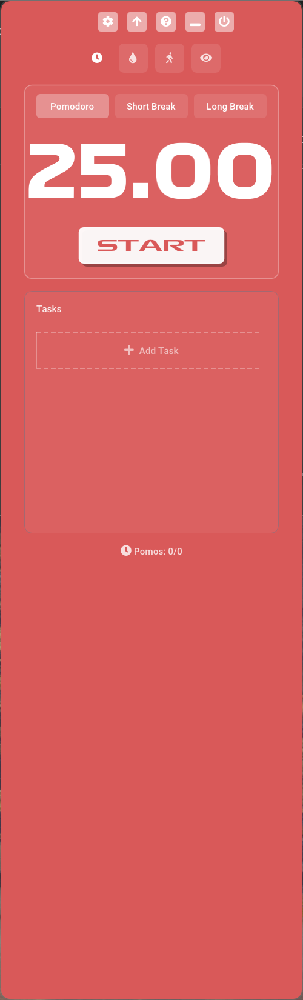
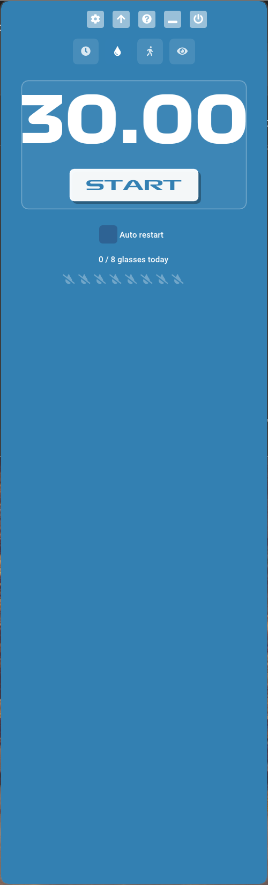
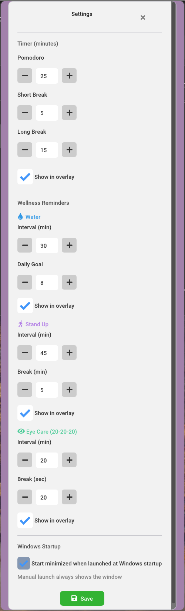
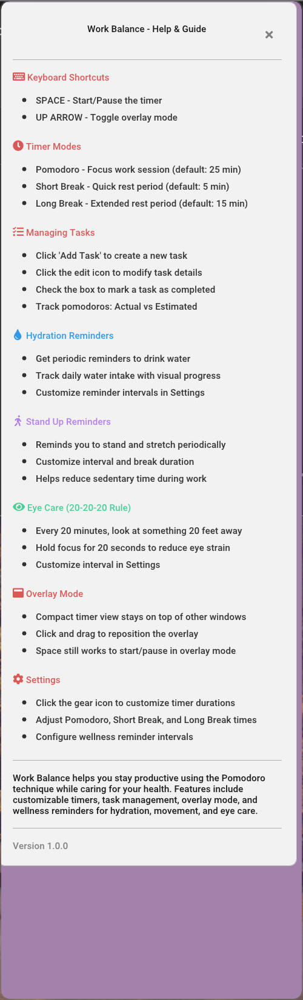

# WorkBalance

<div align="center">



**🚀 Supercharge Your Productivity with the Ultimate Desktop Pomodoro Timer**

*Stay focused. Take breaks. Achieve more.*

[](LICENSE)
[](CROSS_PLATFORM.md)
[](https://en.cppreference.com/w/cpp/23)
[](https://cmake.org/)
[](../../releases)

[Download Latest Release](../../releases) • [Report Bug](https://github.com/tolgayilmaz86/WorkBalance/issues) • [Request Feature](https://github.com/tolgayilmaz86/WorkBalance/issues)

</div>

---

## 🎯 Why WorkBalance?

**WorkBalance** isn't just another Pomodoro timer—it's your personal productivity companion that helps you work smarter, not harder.

Inspired by the beloved [Pomofocus.io](https://pomofocus.io), WorkBalance brings the power of the Pomodoro Technique to your desktop with a beautiful native experience. No browser tabs. No distractions. Just pure, focused productivity.

### 💡 The Science Behind It

The Pomodoro Technique is a proven time management method that breaks work into focused intervals (typically 25 minutes) separated by short breaks. Studies show this approach:

- ✅ **Reduces mental fatigue** through regular breaks
- ✅ **Improves focus** by creating urgency
- ✅ **Boosts motivation** with visible progress
- ✅ **Prevents burnout** with built-in rest periods

---

## ✨ Features That Set Us Apart

<table>
<tr>
<td width="50%">

### 🍅 Smart Pomodoro Timer
Classic 25/5/15 minute intervals with automatic transitions. Track your work sessions effortlessly.

- Customizable durations
- Auto-start options for breaks and pomodoros
- Visual progress indicators
- Audio notifications

</td>
<td width="50%">


</td>
</tr>
<tr>
<td width="50%">



</td>
<td width="50%">

### 💧 Wellness Reminders
Stay healthy while you work! WorkBalance goes beyond productivity with built-in wellness features:

- **Hydration Tracking** - Never forget to drink water
- **Stand-up Reminders** - Combat sedentary work habits
- **Eye Care Alerts** - 20-20-20 rule for eye health
- Auto-loop timers for continuous reminders

</td>
</tr>
<tr>
<td width="50%">

### 🪟 Always-On-Top Overlay
A sleek, minimal overlay that stays visible while you work. See your timer without switching windows.

- Transparent, draggable design
- Shows active timers at a glance
- Doesn't steal focus
- Toggle visibility per timer type

</td>
<td width="50%">


</td>
</tr>
<tr>
<td width="50%">



</td>
<td width="50%">

### ⚙️ Fully Customizable
Make WorkBalance work for you with extensive customization options:

- Adjust all timer durations
- Configure overlay visibility
- Set daily wellness goals
- Auto-start preferences
- Minimize to system tray on startup

</td>
</tr>
</table>

### 📝 Task Management

Keep track of what you're working on with integrated task management:

- Create and organize tasks
- Estimate pomodoros per task
- Track completed pomodoros
- Visual progress indicators

### 🔔 System Tray Integration

WorkBalance lives quietly in your system tray, ready when you need it:

- Start minimized to tray option
- Quick access from tray icon
- Unobtrusive notifications
- One-click window restore

### ❓ Built-in Help

New to Pomodoro? No problem! Press `F1` or click the help icon for instant guidance.



---

## 🚀 Quick Start

### Download & Run

1. **Download** the latest release from the [Releases page](../../releases)
2. **Extract** the archive
3. **Run** `WorkBalance.exe` - No installation required!

### First Steps

1. 🍅 Click **Start** to begin your first Pomodoro
2. 📝 Add tasks to track what you're working on
3. 💪 Take breaks when the timer rings
4. 📊 Watch your productivity soar!

---

## 🖼️ Screenshots Gallery

<div align="center">

| Main Interface | Overlay Mode |
|:--------------:|:------------:|
|  |  |

| Hydration Tracking | Settings |
|:------------------:|:--------:|
|  |  |

</div>

---

## 🛠️ Technologies

WorkBalance is built with modern C++20 and the following cross-platform libraries:

| Library | Purpose | License |
|---------|---------|---------|
| [Dear ImGui](https://github.com/ocornut/imgui) | Immediate mode GUI framework | MIT |
| [GLFW](https://www.glfw.org/) | Cross-platform windowing and input | Zlib |
| [miniaudio](https://github.com/mackron/miniaudio) | Lightweight audio playback | MIT-0 |
| [stb_image](https://github.com/nothings/stb) | Image loading | MIT/Public Domain |
| [OpenGL](https://www.opengl.org/) | Graphics rendering | - |

All dependencies are managed via [vcpkg](https://vcpkg.io/) for seamless cross-platform builds.

---

## 📦 Building from Source

WorkBalance uses **CMake** for a modern, cross-platform build experience. The build system automatically handles all dependencies and asset embedding.

### Prerequisites

- **C++20 compatible compiler**
  - Windows: Visual Studio 2019+ / MSVC 19.25+
  - Linux: GCC 9+ or Clang 10+
  - macOS: Xcode 12+ / Apple Clang 12+
- **CMake 3.15 or higher**
- **vcpkg** (for dependency management)
- **Git**

### Quick Start

#### 1. Clone the Repository
```bash
git clone https://github.com/yourusername/WorkBalance.git
cd WorkBalance
```

#### 2. Install vcpkg (if not already installed)

**Windows (PowerShell):**
```powershell
git clone https://github.com/Microsoft/vcpkg.git
cd vcpkg
.\bootstrap-vcpkg.bat
```

**Linux/macOS:**
```bash
git clone https://github.com/Microsoft/vcpkg.git
cd vcpkg
./bootstrap-vcpkg.sh
```

#### 3. Build with CMake

**Windows:**
```powershell
# Configure
cmake --preset x64-release

# Build
cmake --build --preset x64-release

# Run
.\out\build\x64-release\Release\WorkBalance.exe
```

**Linux/macOS:**
```bash
# Configure
mkdir build && cd build
cmake .. -DCMAKE_BUILD_TYPE=Release \
    -DCMAKE_TOOLCHAIN_FILE=~/vcpkg/scripts/buildsystems/vcpkg.cmake

# Build
cmake --build . --config Release

# Run
./WorkBalance
```

### Build Presets

The project includes CMake presets for common configurations:

- `x64-debug` - Debug build with symbols
- `x64-release` - Optimized release build

```bash
cmake --preset x64-release
cmake --build --preset x64-release
```

---

## 🌐 Cross-Platform Support

WorkBalance is designed to work seamlessly across all major desktop platforms:

| Platform | Status | Notes |
|----------|--------|-------|
| **Windows 10/11** | ✅ Fully Supported | Includes rounded window corners on Windows 11 |
| **Linux** | ✅ Fully Supported | Tested on Ubuntu, Fedora, Arch |
| **macOS** | ✅ Fully Supported | macOS 10.15+ recommended |

All core features work identically on every platform. For detailed platform-specific build instructions, see [BUILD.md](docs/BUILD.md).

---

## ⌨️ Keyboard Shortcuts

| Key | Action |
|-----|--------|
| `Space` | Start/Pause timer |
| `↑` Up Arrow | Skip to next timer |
| `F1` | Open help dialog |
| `Escape` | Close dialogs |

---

## 🎨 Timer Modes

WorkBalance includes three carefully designed timer modes based on proven productivity research:

| Mode | Duration | Purpose |
|------|----------|---------|
| 🍅 **Pomodoro** | 25 min | Deep, focused work session |
| ☕ **Short Break** | 5 min | Quick mental reset |
| 🌴 **Long Break** | 15 min | Extended rest after 4 pomodoros |

All durations are fully customizable in Settings!

---

## 📁 Project Structure

The project is designed with a modular architecture for easy maintenance and extension. Core functionality is currently consolidated for simplicity, with plans for a more structured codebase in future releases.

Key components:
- **CMake build system** - Modern, cross-platform build configuration
- **Embedded resources** - All fonts, sounds, and icons compiled into the executable
- **Cross-platform code** - Platform-specific features gracefully degrade

---

## 🤝 Contributing

We welcome contributions from the community! Whether you're a seasoned developer or just getting started, there's a place for you:

| Type | Description |
|------|-------------|
| 🐛 **Bug Reports** | Found something broken? Let us know! |
| 💡 **Feature Ideas** | Have a suggestion? We'd love to hear it |
| 📖 **Documentation** | Help improve our docs and guides |
| 🔧 **Code** | Submit PRs for bug fixes or new features |
| 🌐 **Translations** | Help make WorkBalance accessible worldwide |

Check out our [Contributing Guide](CONTRIBUTING.md) to get started!

[](https://buymeacoffee.com/tlgylmz)

Your support helps fund continued development, new features, and community resources!

---

## 📄 License

This project is licensed under the **Apache License 2.0** - see the [LICENSE](LICENSE) file for details.

### Third-Party Licenses

- **Dear ImGui** - MIT License
- **GLFW** - Zlib License
- **miniaudio** - MIT-0 License (Public Domain)
- **stb_image** - MIT License / Public Domain
- **Font Awesome 5 Pro** - Commercial License (icons only)
- **Formula1 Fonts** - Used under license

---

## 🙏 Acknowledgments

- **[Pomofocus.io](https://pomofocus.io)** - The inspiration behind this desktop implementation
- **[Omar Cornut](https://github.com/ocornut)** - Creator of the amazing Dear ImGui
- **GLFW Contributors** - Making cross-platform windowing a breeze
- **[David Reid](https://github.com/mackron)** - miniaudio library for seamless audio
- **[Sean Barrett](https://github.com/nothings)** - stb single-file libraries

---

## 👨‍💻 Author

**Tolga Yilmaz** - [GitHub](https://github.com/tolgayilmaz86)

---

## 🔮 Roadmap

- [x] ✅ Settings persistence
- [x] ✅ System tray integration
- [x] ✅ Wellness timers (hydration, stand-up, eye care)
- [x] ✅ Always-on-top overlay
- [x] ✅ Start minimized option
- [ ] 📊 Statistics and analytics dashboard
- [ ] 🎨 Multiple themes (dark, light, custom)
- [ ] 🔊 Custom sound alerts
- [ ] 🏷️ Task categories and tags
- [ ] 📤 Export/import task history
- [ ] 🔄 Sync across devices

---

<div align="center">

## 💖 Support Development

If WorkBalance helps you stay productive, consider supporting its development!

[](https://buymeacoffee.com/tlgylmz)

Your support helps fund new features, bug fixes, and keeps the project alive!

---

**Built with ❤️ using Modern C++23 and Dear ImGui**

*WorkBalance - Because your time matters.*

[⬆ Back to Top](#workbalance)

</div>
